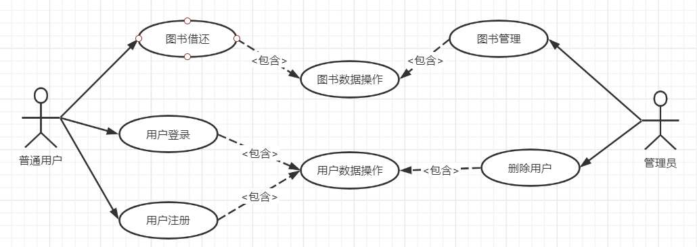
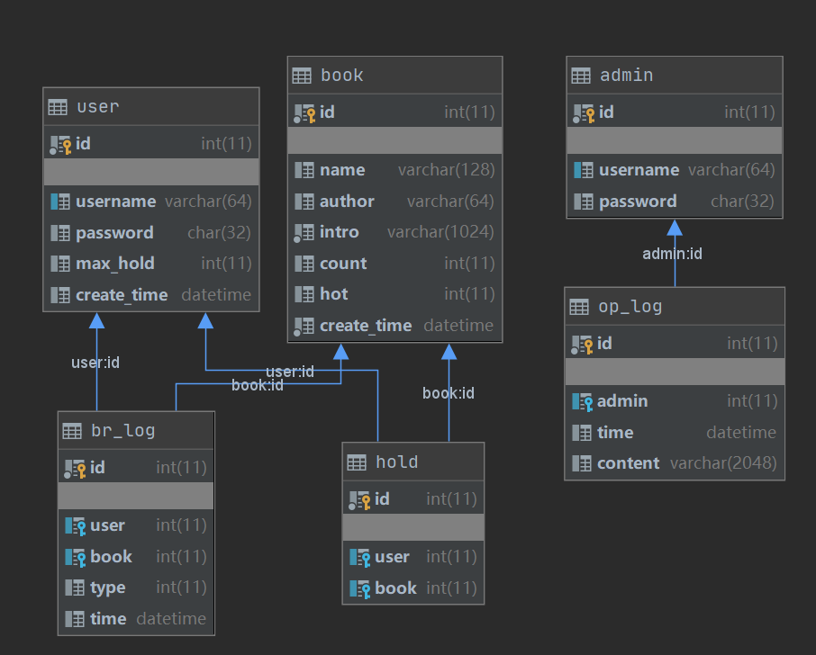
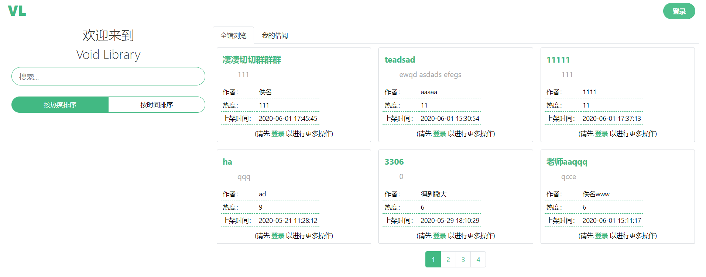
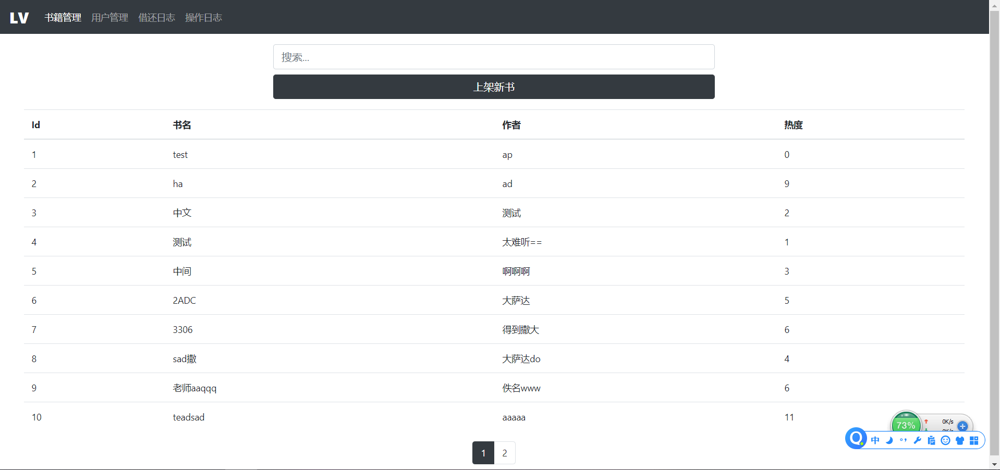
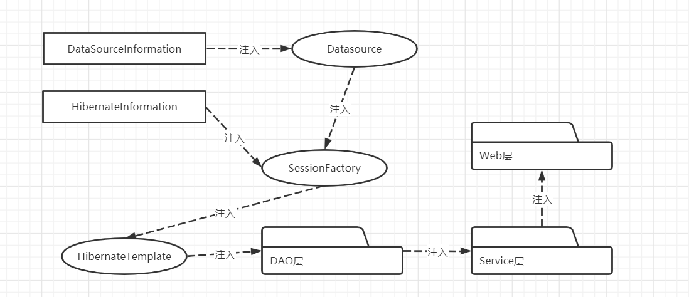
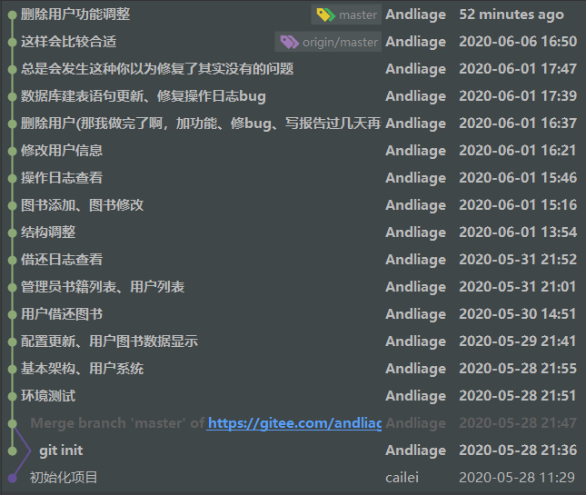

# 软件工具与环境大作业
学校：西安理工大学  
学院：计算机科学与工程学院  
班级：软件172  
姓名：张宇强  
学号：3170921047  
时间：2020年6月  
## 系统基本说明
### 概况
本系统是软件工具与环境的大作业，采用Struts2 + Spring + Hibernate框架编写的Java Web项目。
### 编译及运行环境
- Java 8
- MySQL 8.0
- Tomcat 9.0
## 设计
### 基本业务设计
系统基本用例图：  

系统分两大模块，普通用户模块和管理员模块，普通用户可以登录、注册、借还图书。管理员通过管理员账号登录，可以对用户和图书数据进行管理，包括查看、修改、删除信息和查看操作日志。
### 数据库设计
数据库类图：  

其中：  
user为用户表，存储用户信息  
book为书籍表，存储书籍信息  
admin为管理员表，存储管理员信息  
hold为用户和书籍多对多中间表，表示用户已借阅某书籍  
br_log为借还日志表，记录用户借还操作  
op_log为操作日志表，记录管理员操作  
### 前端设计
首页：  

管理员页：  

## Struts2
### Struts2框架MVC的基本使用
struts.xml部分配置，渲染首页的action
```xml
<package name="index" namespace="/" extends="base">
    <default-action-ref name="index"/>
    <action name="index" class="com.opensymphony.xwork2.ActionSupport">
        <result name="success">
            /WEB-INF/index.html
        </result>
    </action>
</package>
```
### Struts2标签库和OGNL
额……我放弃了jsp，没用上
### Struts2拦截器的应用
用拦截器验证用户/管理员是否登录  
struts.xml部分配置
```xml
<package name="base" extends="json-default">
    <interceptors>
        <interceptor name="userLogin" class="com.andliage.library.interceptor.UserLoginInterceptor"/>
        <interceptor name="adminLogin" class="com.andliage.library.interceptor.AdminLoginInterceptor"/>
    </interceptors>
    <global-results>
        <result name="notLogin" type="json">
            <param name="root">jsonMap</param>
        </result>
    </global-results>
</package>
```
管理员登录拦截器实现：部分java代码
```java
@Override
public String intercept(ActionInvocation actionInvocation) throws Exception {
    if (notLogin()) {
        deal();
        return "notLogin";
    } else {
        return actionInvocation.invoke();
    }
}
```
## Hibernate
### Hibernate持久化过程
对象关系见上文数据库设计部分  
由于映射文件较多，展示User.hbm.xml部分代码，其他文件可前往开源网站查看  
```xml
<class name="com.andliage.library.entity.User" table="user" schema="library">
    <id name="id">
        <column name="id" sql-type="int(11)"/>
    </id>
    <property name="username">
        <column name="username" sql-type="varchar(64)" length="64" not-null="true"/>
    </property>
    <property name="password">
        <column name="password" sql-type="char(32)" length="32" not-null="true"/>
    </property>
    <property name="maxHold">
        <column name="max_hold" sql-type="int(11)" not-null="true"/>
    </property>
    <property name="createTime">
        <column name="create_time" sql-type="datetime" not-null="true"/>
    </property>
    <set name="holdBooks" table="hold" lazy="false" cascade="save-update">
        <key column="user"/>
        <many-to-many class="com.andliage.library.entity.Book" column="book"/>
    </set>
</class>
```
### Hibernate关系管理
本系统存在：  
用户和图书的多对多关系  
管理员和操作日志的一对多关系  
用户和借还日志的一对多关系  
图书和借还日志的一对多关系  
以用户和图书的关系为例，xml配置如下：
User.hbm.xml部分代码 ：  
```xml
<set name="holdBooks" table="hold" lazy="false" cascade="save-update">
    <key column="user"/>
    <many-to-many class="com.andliage.library.entity.Book" column="book"/>
</set>
```
Book.hbm.xml部分代码：  
```xml
<set name="holdUsers" table="hold" lazy="false" cascade="save-update" inverse="true">
    <key column="book"/>
    <many-to-many class="com.andliage.library.entity.User" column="user"/>
</set>
```
这里Book的inverse设置为true，放弃维护关系，让User来维护关系，避免重复维护产生问题。  
java实体类部分代码：  
```java
public class User {
    private Set<Book> holdBooks = new HashSet<>();

    public Set<Book> getHoldBooks() {
        return holdBooks;
    }

    public void setHoldBooks(Set<Book> holdBooks) {
        this.holdBooks = holdBooks;
    }
}
```
java中使用关系：  
```java
user.getHoldBooks().add(book);
book.getHoldUsers().add(user);
accountDAO.updateUser(user);

user.getHoldBooks().remove(book);
book.getHoldUsers().remove(user);
accountDAO.updateUser(user);
saveNewBRLog(user, book, BR_LOG_RETURN);
```
### Hibernate检索
使用HQL检索  
部分Java代码：  
```java
public User findUserByName(String username) {
    String hql = "from User u where u.username = ?";
    List<User> list = (List<User>) template.find(hql, username);
    return list.isEmpty() ? null : list.get(0);
}
```
### 分页查询功能
通过Hibernate的Query对象功能实现分页查询  
部分java代码
```java
query.setFirstResult((page - 1) * UserService.COUNT_PER_PAGE_ADMIN);
query.setMaxResults(UserService.COUNT_PER_PAGE_ADMIN);
```
## Spring
### Spring容器的使用
Spring注入关系图：  

### Spring AOP的使用
这个也没用上，事后再说的东西
### Spring的Template
在BaseDAO中注入模板，其他DAO类继承BaseDAO，数据库操作都通过模版提供的功能进行，如
```java
template.find(hql);
template.save(user);
template.update(user);
template.delete(user);
template.flush();
```
## 版本控制
### git的使用
本系统使用git管理源码版本，编写文档时git log如下

也可在  
码云：https://gitee.com/andliage/final-project  
GitHub：https://github.com/AndliagePox/void-library  
查看最新源码和提交记录
## 附加(其他技术和工具)
### Spring MD5加密
本系统在数据库存储用户密码时不使用明文存储，以提高安全性，在登录时比对用户输入密码的MD5散列值和数据库中的散列值来判断是否登录成功。通过Spring的DigestUtils来计算MD5值。
```java
DigestUtils.md5DigestAsHex(password.getBytes())
```
### vue框架
项目前端使用了vue框架，组件化开发提高了开发效率和可重用性。  
还使用了vue-router路由组件，将路由跳转交由浏览器处理，前端通过ajax技术，除了获取首次访问或访问更新后的静态资源，只通过接口与后台进行少量数据交换(通过http请求和返回的json数据)，提高性能和后台通用性。
### Bootstrap组件库
通过使用组件库的组件，减少css样式编写，提高开发效率。
